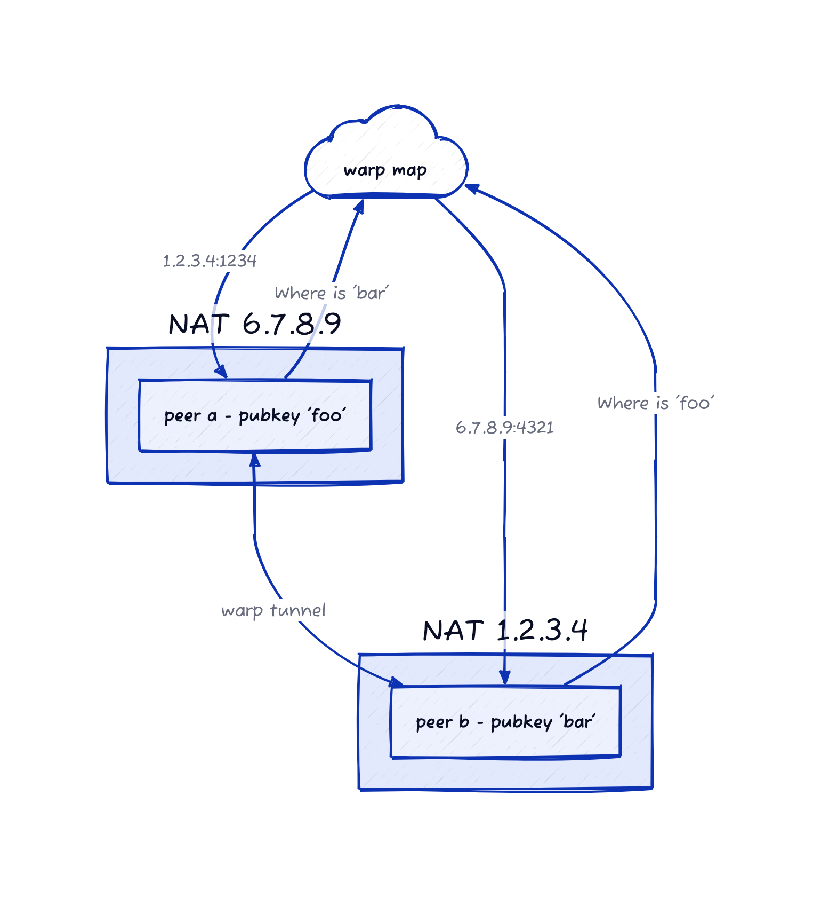

# WARP Aggregation & Redundancy Protocol

The "WARP" system is made up of the following pieces:
- warp gates: endpoints for applications to send and receive data from
- warp tunnels: magic transport layer which will deliver application data between warp gates
- warp map: a publicly routable server that facilitates discovery of peers

## Application Abstraction

Warp is built around providing the "warp gate" abstraction. Applications can send and receive data to/from a warp gate
as if it was the remote endpoint that it was designed to communicate with and with no changes to the application, the
data transport will benefit from the aggregation and redundancy of the warp tunnel.

<!--- %d2lang
direction: right

left_application: "Application" {
  style.stroke: red
  style.fill: pink
}
right_application: "Application" {
  style.stroke: green
  style.fill: lightgreen
}

warp_tunnel: "warp tunnel"
warp_tunnel.left_gate: "gate" {
  style.stroke: red
  style.fill: pink
}
warp_tunnel.right_gate: "gate" {
  style.stroke: green
  style.fill: lightgreen
}

warp_tunnel.left_if0: "interface 0" {
  style.stroke: red
  style.fill: pink
}
warp_tunnel.left_if1: "interface 1" {
  style.stroke: red
  style.fill: pink
}
warp_tunnel.left_ifN: "interface N" {
  style.stroke: red
  style.fill: pink
}

warp_tunnel.right_if0: "interface 0" {
  style.stroke: green
  style.fill: lightgreen
}
warp_tunnel.right_if1: "interface 1" {
  style.stroke: green
  style.fill: lightgreen
}
warp_tunnel.right_ifN: "interface N" {
  style.stroke: green
  style.fill: lightgreen
}

left_application <-> warp_tunnel.left_gate
warp_tunnel.left_gate <-> warp_tunnel.left_if0
warp_tunnel.left_gate <-> warp_tunnel.left_if1
warp_tunnel.left_gate <-> warp_tunnel.left_ifN

# warp_tunnel.left_if0 <-> warp_tunnel.right_if0
warp_tunnel.left_if0 <-> warp_tunnel.right_if1
warp_tunnel.left_if0 <-> warp_tunnel.right_ifN
warp_tunnel.left_if1 <-> warp_tunnel.right_if0
# warp_tunnel.left_if1 <-> warp_tunnel.right_if1
warp_tunnel.left_if1 <-> warp_tunnel.right_ifN
warp_tunnel.left_ifN <-> warp_tunnel.right_if0
warp_tunnel.left_ifN <-> warp_tunnel.right_if1
# warp_tunnel.left_ifN <-> warp_tunnel.right_ifN

warp_tunnel.right_if0 <-> warp_tunnel.right_gate
warp_tunnel.right_if1 <-> warp_tunnel.right_gate
warp_tunnel.right_ifN <-> warp_tunnel.right_gate

warp_tunnel.right_gate <-> right_application
--->

In this figure, red boxes represent components running on one computer; green boxes represent components running on
a separate computer.

Warp gates can be configured in two ways:
- Loopback Sockets
- Unix Domain Sockets

### Loopback sockets

Loopback sockets are useful if the application is designed to communicate with a remote endpoint. The only change to the
application will be to change where it sends/receives data to/from to the loopback address of the warp gate
(eg. "127.0.0.1:9000").

### Unix Domain Sockets

Unix Domain Sockets provide some extra feedback to the application based on network congestion.

The `send()` syscall in the application will block until that particular payload has been sent.

## Network Architecture

<!--- %d2lang
direction: right
warp_map: "warp map" {
  shape: cloud
}
network_a: "NAT 6.7.8.9"
network_a.peer: "peer a - pubkey 'foo'"

network_b: "NAT 1.2.3.4"
network_b.peer: "peer b - pubkey 'bar'"

network_a.peer <-> network_b.peer: warp tunnel

network_a.peer -> warp_map: "Where is 'bar'"
warp_map -> network_a.peer: "1.2.3.4:1234"

network_b.peer -> warp_map: "Where is 'foo'"
warp_map -> network_b.peer: "6.7.8.9:4321"
--->

All instances of warp are identified by their public key. While running, warp will periodically update the warp map with
all interfaces that it can use to send & receive as well as querying the warp map for details about the peer it is
establishing warp tunnels with.