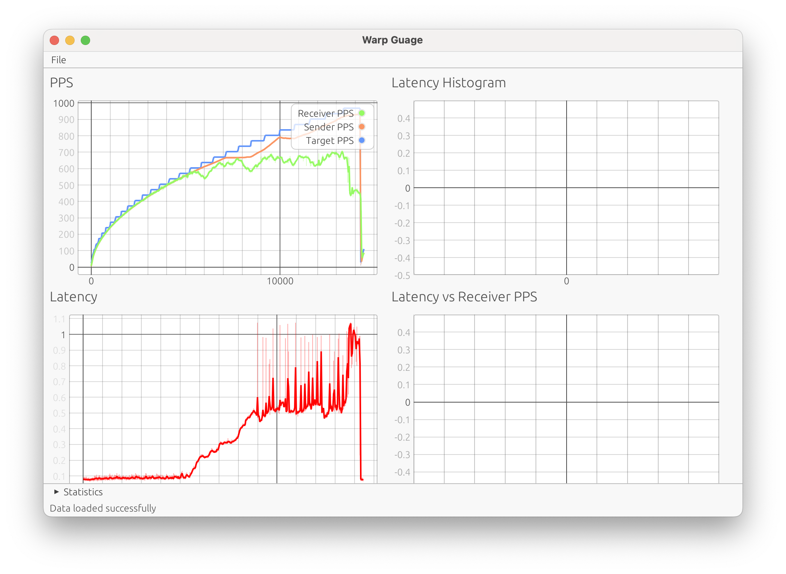
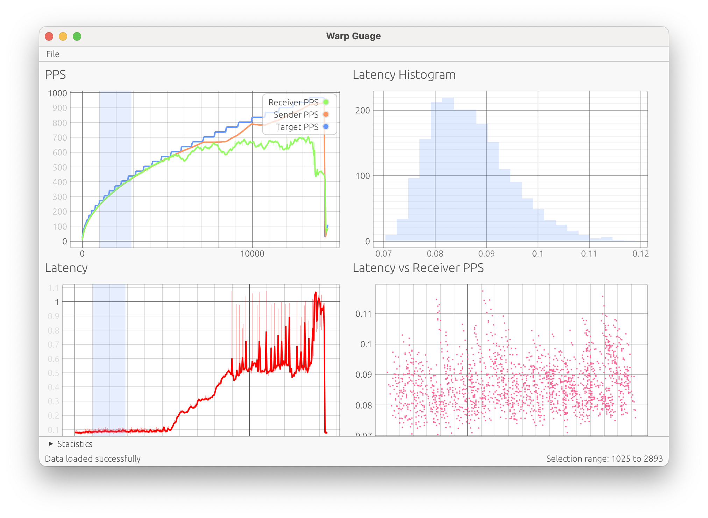

# warp-gauge

`warp-guage` is a tool for measuring the one-way quality of a link and visualising the measurements. There are three components:

- `warp-gauge tx`
- `warp-gauge rx`
- `warp-gauge` (or `warp-gauge inspector`)

## Transmitter

The transmitter is invoked with the arguments:

```
warp-gauge tx <DESTINATION> <PEAK_PPS> <BASE_PPS> <PERIOD>
```

- `DESTINATION` is where UDP datagrams will be sent; a receiver (see below) needs to be listening for them to log measurements
- `PEAK_PPS`, `BASE_PPS`, `PERIOD` adjust the pattern used by the transmitter. It will send packets in a sawtooth pattern: starting at `BASE_PPS` and ramping linearly over `PERIOD` seconds to `PEAK_PPS` before resetting


## Receiver

The receiver is invoked with the arguments:

```
warp-gauge rx <BIND_ADDRESS> <OUTPUT_PATH>
```

- `BIND_ADDRESS` is where the receiver will listen for `warp-gauge tx` datagrams 
- `OUTPUT_PATH` is where the instrumentation data will be logged.

`BIND_ADDRESS` can be a IP:Port pair like `0.0.0.0:9000` to listen on port 9000 across all interfaces or a Unix Domain Socket path like `/tmp/warp-gauge.sock`


## Inspector

The inspector is used to analyse data from the [receiver](#Receiver). Data can be loaded with `File > Open`.



The two plots on the left share a common "time" x-axis. The axis actually represents the datagram counter which increases monotonically (but not linearly) with time:
- The top plot shows the target PPS of the sender, the achieved PPS of the sender and the received PPS of the receiver
- The bottom plot shows the latency of each datagram received by the receiver

Notes:
- Target PPS and achieved PPS of the sender can differ for a number of reasons including:
  - Overloaded system
  - NIC of sender was unable to keep up with PPS
- Sender achieved PPS and receiver PPS will differ whenever there is packet loss
- Latency is measured across two clock domains (sender and receiver) so the value is not necessarily meaningful (as it includes the clock skew between them) but the differences between successive measurements is.

Selections of ranges of interest can be made by Shift + dragging on either of the two plots on the left.



When a range is selected, the plots on the right will populate:
- The top plot shows a histogram of the latencies of the selected datagrams
- The bottom plot plots the latency of each point against the PPS of that point