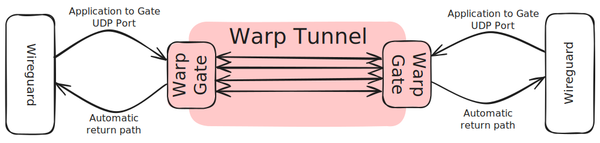
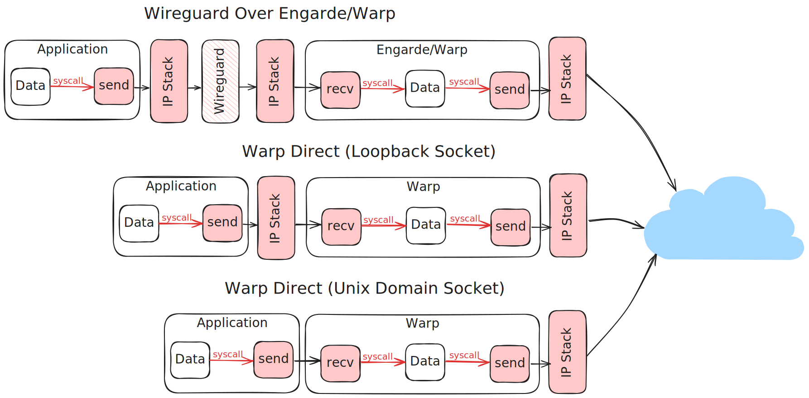

# Wireguard over WARP

WARP is inspired by [engarde](https://github.com/porech/engarde/). Here are some notes to migrate an engarde
setup to warp.



Warp adds the ability to hole-punch wireguard connections which allows us to establish a wireguard connection between
the vehicle and operator station when both of them may have dynamic IP addresses and be behind NAT firewalls.

## Long term plan

The long term plan is to replace our use of wireguard over warp/engarde for vehicle <-> operator station traffic
entirely with warp. This is for a few reasons:

1. Enable back-pressure aware clients using Unix Domain Sockets
2. Prevent double-encryption of traffic
3. Eliminate an extra syscall/round-trip through the kernel & IP stack

### Enable back-pressure aware clients using Unix Domain Sockets

Unix domain sockets:

- Block the sender until their data has been read
- Have extremely large MTUs (effectively unlimited)
- Avoid a trip through the IP stack

These features combined mean that applications can be written in a way that they handle back-pressure from a congested
warp tunnel AND don't have to care about packet fragmentation by offloading all MTU/fragmentation logic to warp.

### Prevent double-encryption of traffic

Due to the need to establish the UDP hole punch and send the data payload over the same port, the control messages and
data are wrapped with a header to allow disambiguation.

The header + wrapping are encrypted to protect their contents in flight.

This results in the wireguard messages being double-encrypted (once with wireguard, and again by warp).

As a **hack**; the double encryption of traffic over the warp tunnel can be disabled by modifying
[warp_protocol::messages](../warp-protocol/src/messages.rs) such that `warp_protocol::messages::TunnelPayload::data` is
marked with the attribute `#[Aead(associated_data)]` instead of `#[Aead(encrypted)]`

### Eliminate an extra syscall/round-trip through the kernel & IP stack



In this figure:
 - Userspace to kernal mode (or vice-versa) transfers are drawn with red arrows
 - Userspace components are unshaded
 - Kernel mode components are shaded in pink
 - Wireguard is hatched as it may be user mode or kernal mode depending on the platform

## No server/client roles

All warp instances are "clients" and coordinate with the warp-map to establish how to listen for and send traffic.

As a result, the corresponding wireguard configuration will need to specify an `Endpoint` which matches the
`application_to_gate` port of a warp tunnel.

There is no need to specify a listen address for any of the wireguard peers.

## Wireguard to "gate" configuration

Wireguard is only able to send UDP packets so the warp gate responsible for receiving wireguard traffic needs to be
be configured with a loopback gate.

## Example configuration

Given the following wireguard configuration:

```
[Interface]
PrivateKey = sBhxxaCLcvHRKTYFCJbDdE+dlHa+IEMf8nfBRKAG2kw= # Pubkey = cIU7TBiadNE6/ze/B6YypEEIQehLFDbnFjfZ+lm8IHg=
Address = 192.168.255.1

[Peer]
PublicKey = q7W6YTUxuutUKG2zBi672H8xqY+VshzCcwa3sm+txCg=
AllowedIPs = 192.168.255.2/32
PersistentKeepalive = 25
Endpoint = 127.0.0.1:59401
```

This is a potential engarde (client) configuration:

```
client:
  listenAddr: "127.0.0.1:59401"   # In warp this maps to the application_to_gate port
  dstAddr: "74.111.169.64:59402"  # In warp this is fetched from the warp-map based on public keys
  excludedInterfaces:             # In warp this maps to interfaces.exclusion_patterns
    - "docker0"
    - "enp6s0"
    - "wlp5s0"
    - "wg0"
    - "wg0-pit"
    - "wt0"
    - "lo"
```

A roughly equivalent warp config would be:

```
private_key = "<run warp-keygen to generate>"

[interfaces]
interface_scan_interval = 10
exclusion_patterns = ["lo", "wg.*", "wt.*", "wlp.*", "enp.*", "docker.*"]

[warp_map]
address = "warp-map.mapless.dev:13116"
public_key = "0B2XTQXPMCXTKYFPYR5DY8T61W2186HD569YQWMPTV56E1VH7ZS82"

[far_gate]
public_key = "<get from peer>"

[tunnels.wireguard.gate]
ipv4 = true
application_to_gate = 59401

[tunnels.wireguard.transport]
mtu = 1400
ordered = false

[tunnels.wireguard.transport.redundancy]
num_shards = 5
required_shards = 3
```

With this configuration, warp will listen on port 59401 for traffic from wireguard and send it to the specified peer.

Engarde does N-to-1 (server is assumed to be running on a reliable interface)